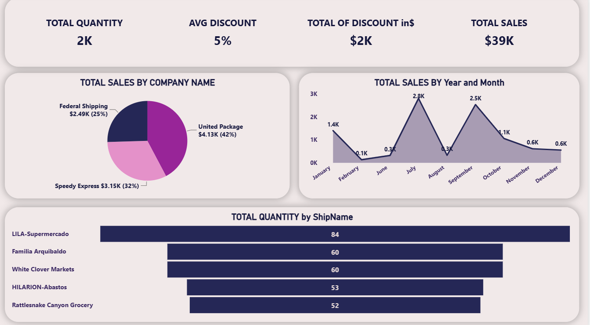

# 📦 Shipping & Sales Performance Dashboard - Power BI

## 📌 Project Overview
This dashboard provides a focused analysis of **shipping and sales performance**, tracking order quantities, discounts, revenue, and carrier performance. Built using **Power BI** with **Power Query** for data transformation and **Figma** for prototyping, the dashboard enables logistics and sales managers to monitor shipping partner performance, identify top customers, and optimize discount strategies.

## 🖥️ Dashboard Preview

## 🎯 Objectives
- Monitor total quantity, average discount, total discount value, and total sales.
- Analyze sales distribution by shipping company.
- Identify top customers by order quantity.
- Provide actionable insights to optimize shipping partnerships and discount strategies.

## 🛠️ Tools Used
- **Power BI** – Dashboard design and interactive visualizations
- **Power Query** – Data extraction, cleaning, and transformation
- **DAX** – Custom measures for KPIs and calculations

## 💡 Key Insights
- **Total Quantity** sold reached **2K** units.
- **Average Discount** across all transactions is **5%**, with a total discount value of **$2K**.
- **Total Sales** generated **$39K** in revenue.
- **United Package** is the top shipping carrier, accounting for **42%** of total sales, followed by **Speedy Express** (**32%**) and **Federal Shipping** (**25%**).
- **LILA-Supermercado** leads in order quantity, followed by **Familia Arquibaldo**, **White Clover Markets**, **HILARION-Abastos**, and **Rattlesnake Canyon Grocery**.

## 📋 Dashboard Features

### Key Performance Indicators (KPIs)
- **Total Quantity** – Units sold
- **Avg Discount** – Average discount percentage
- **Total of Discount in $** – Total discount value
- **Total Sales** – Overall revenue generated

### Filters & Interactivity
- **Company Name** – Filter by shipping carrier
- **ShipName** – Filter by customer
- **Date Range** – Time-based filtering

### Visualizations
- **Cards** – KPI summaries at the top
- **Pie chart** – Sales distribution by shipping company
- **Horizontal bar chart** – Top customers by order quantity
- **Slicers** – Interactive filters for dynamic exploration

